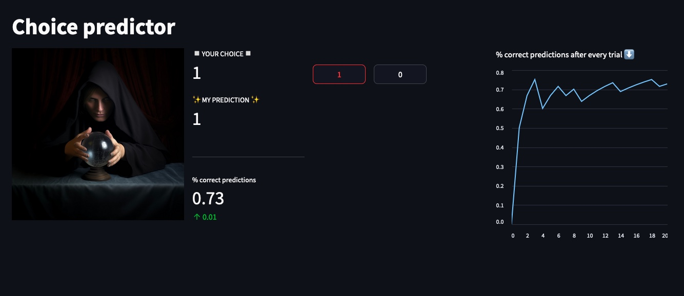

# Building a Choice Predictor with Streamlit and XGBoost

## Background
In my research experiments participants were asked make many binary choices between "heads" and "tails" of a coin (for more details, see our publication [here](https://www.frontiersin.org/articles/10.3389/fpsyg.2023.1113654/full)). Participants were specifically instructed to make these choices randomly, without following any pattern. We looked at how well people performed the task and explored what happens in their brain while doing it.

I decided to build a similar experiment in a web application using streamlit, which is handy a Python library that turns data scripts into shareable web apps.
The program (I call it ✨choice predictor✨) asks users to make binary choices (1 or 0), and the algorithm learns from these choices to predict the next one.
The full code is on my [github](LINK). 

## Procedure in a nutshell
1. User makes a set amount of choices by pressing one of two buttons to create an initial training set.
2. As soon as this initial set is gathered, the algorithm does a parameter search to find  optimal number of features.
3.This optimal number of features is used to make a prediction for the user's next choice. 
4. After every X steps (X is determined by the `interValToTest` constant), a new parameter search is run and the newly found optimal parameter is used in the updated model for the following predictions

Additionally some metrics are displayed, e.g. the % of correct predictions, with an indicator of whether and by how much the percentage changed compared to the previous one. A line chart illustrates the percentage metric over time.

It's possible to choose the specific ML algorithm used to make the predictions, by specifying `which_model` to `xgboost`, `logreg` (logistic regression) or `randomForest`

The app is deployed under this link:

[INCLUDE IMAGE OF THE PREDICTOR!]

